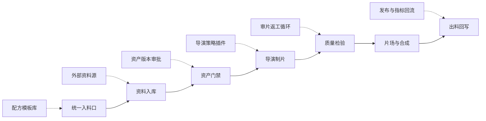

# 像素短剧工厂后续搭建计划

## 当前基线

当前卡带已经具备一条按 `CF-FARP@0.1` 协议认证的主生产线：统一入料口、资料入库、物料总线、资产门禁、导演制片、质检、片场渲染、出片合成、交付汇总和连续性回写。当前实现已经使用 `assemble_material_inventory` 形成 `production_context`；主链不再执行本地演示资产预置，避免自动造料绕过资产门禁。

后续扩展不要直接把新能力插进主链。先用 `custom_action` 占位节点挂在相关工位的 `branch` 链路上，等数据契约、工具实现和运行界面都稳定后，再转成正式机器节点或传递节点。

## 阶段 1：运行界面

目标：用户拿到卡带后，不需要进入设计台，也能理解当前跑到哪里。

- 做卡带运行专属界面，只展示 `开始 -> 入料口 -> 资料入库 -> 资产门禁 -> 导演制片 -> 质检 -> 出片 -> 出料口 -> 完成`。
- 每个重点节点显示状态：等待、运行中、完成、失败、需要人工确认。
- 进度条按重点节点推进，点击重点节点可展开本工位机器详情。
- 失败时显示失败工位、失败机器、输入料、输出料和建议重跑点。

验收：普通用户不看 30 多个节点，也能知道应该填什么、现在跑到哪、失败后该回到哪里。

## 阶段 2：配方模板库

对应未来能力：配方模板库。当前 `root.flow.json` 尚未放置 `future_recipe_templates` 占位节点。

- 把 `product_recipe` 拆成可选择模板：三镜头短剧、对话推进、线索揭示、氛围循环、产品广告、游戏过场。
- 每个模板定义默认镜头数、镜头密度、资产策略、质检阈值和出料规格。
- 入料口支持“选择模板 + 覆盖局部字段”，而不是从零填写所有字段。
- 模板输出 `recipe_template_profile`，后续可由新增的配方暂存/合并节点并入生产上下文。

验收：同一套流程可以通过不同入料配方生成不同产品形态。

## 阶段 3：资料与资产工业化

对应未来能力：外部资料源接入。当前 `root.flow.json` 尚未放置 `future_material_connectors` 占位节点。

已保留隔离资产工坊节点：`asset_character_forge`，当前负责 Godot 角色 spritesheet 与地点分层 PNG 的离线生成。它是 `params.isolated=true` 的开发支线，不进入协议认证主链；转正前必须先明确数据契约、失败策略和审批规则。

- 外部资料源接入：剧本库、项目文件夹、网页资料、数据库、知识库。
- 所有资料源统一转成 `external_material_pack`，再进入物料总线。
- 资产清单增加版本字段：正式、候选、草稿、弃用、缺失。
- 加入资产审批记录、替换建议和回滚记录。

验收：资料和资产不再只靠本地 JSON，可以接入真实项目资料库，并且所有资产状态可追踪。

## 阶段 4：多 AI 并行与返工

对应未来能力：导演策略插件和审片返工循环。当前 `root.flow.json` 尚未放置 `future_director_variants`、`future_review_loop` 占位节点。

- 导演制片支持多策略并行：节奏版、保守版、强镜头运动版、低成本版。
- 质检节点不只判断通过/失败，还输出结构化 `revision_ticket`。
- 返工票据可以指向导演、资产门禁、片场或合成工位，支持局部重跑。
- 运行界面显示返工次数和返工原因。

验收：不是一次线性跑到底，而是能在工业生产线上局部返修。

## 阶段 5：发布与指标回流

对应未来能力：发布与指标回流。当前 `root.flow.json` 尚未放置 `future_publish_metrics` 占位节点。

- 出片后生成发布包：MP4、预览页、封面、字幕、镜头表、生产报告。
- 接入发布目标：本地目录、内容平台、项目交付目录。
- 回收播放数据、用户反馈和人工评分。
- 将反馈回写到配方模板和连续性状态，形成下一集生产输入。

验收：卡带不只负责生成视频，还能形成产品迭代闭环。

## 实施顺序

1. 先完成运行专属界面，因为它决定用户怎么理解整条生产线。
2. 再做配方模板库，因为它决定“不同入料生成不同产品”的产品能力。
3. 再做资料和资产工业化，解决真实项目资料量变大后的可维护性。
4. 再做多 AI 并行和返工，让流程从单次生成升级为可控生产。
5. 最后做发布和指标回流，形成长期迭代闭环。

## 转正规则

占位节点转成正式节点前，必须满足：

- 输入、输出、失败结构都有明确数据契约。
- 有最小可用工具实现，不能只停留在说明文案。
- 运行界面能解释它的状态和错误。
- 不破坏主链路的可运行性。
- 有一条可复现的测试样例。
