# 像素短剧工厂卡带流程说明

本文描述 `dev.pixel_episode_director` 在 CF-FARP-0.1 协议下的当前流程。当前版本已经从探索期流程收敛为协议感知卡带：`manifest.json` 声明 `base_contract`、`runtime_contract`、`delivery_readiness` 和协议认证标签，`root.flow.json` 主链只保留当前基座可声明、可检测、可认证的能力。

## 当前状态

- 协议：`CF-FARP@0.1`
- 卡带版本：`0.1.0-dev`
- 认证标签：`cf-farp-0-1-certified`
- 主交付键：`episode_delivery`
- 隔离支线：`asset_character_forge`、`remote_comfy_upgrade`

## 主链路

```mermaid
flowchart LR
  start([开始]) --> welcome_ui["工厂看板"]
  welcome_ui --> collect_episode_brief["统一入料口"]
  collect_episode_brief --> dispatch_material_reads["协议工单：资料入库"]

  dispatch_material_reads --> load_series_bible["读取系列设定"]
  dispatch_material_reads --> load_world_state["读取连续状态"]
  dispatch_material_reads --> load_shot_presets["读取镜头预设库"]
  dispatch_material_reads --> load_asset_manifest["读取资产清单"]

  load_series_bible --> assemble_material_inventory["组装物料清单"]
  load_world_state --> assemble_material_inventory
  load_shot_presets --> assemble_material_inventory
  load_asset_manifest --> assemble_material_inventory

  assemble_material_inventory --> plan_asset_check["协议工单：资产门禁"]
  plan_asset_check --> asset_check["已批准资产检查"]
  asset_check --> plan_draft_asset_request["协议工单：草稿参考资产"]
  plan_draft_asset_request --> generate_draft_asset["生成草稿候选"]
  generate_draft_asset --> assemble_director_package["组装导演包"]

  assemble_director_package --> plan_shot_plan_request["协议工单：镜头表"]
  plan_shot_plan_request --> generate_shot_plan["生成镜头表 JSON"]
  generate_shot_plan --> plan_validate_request["协议工单：质量校验"]
  plan_validate_request --> validate_shot_plan["校验镜头表与资产"]

  validate_shot_plan --> assemble_render_package["组装渲染包"]
  assemble_render_package --> plan_render_request["协议工单：片场渲染"]
  plan_render_request --> godot_render["渲染像素 2.5D"]
  godot_render --> select_delivery_source["选择出料来源"]
  select_delivery_source --> plan_mux_request["协议工单：出片合成"]
  plan_mux_request --> ffmpeg_mux["生成出片包"]

  ffmpeg_mux --> plan_world_state_update["协议工单：连续性回写"]
  plan_world_state_update --> update_world_state["更新连续状态"]
  update_world_state --> assemble_episode_delivery["交付汇总"]
  assemble_episode_delivery --> result_ui["出料报告"]
  result_ui --> complete([完成])
```

## 关键收敛

1. `llm_prompt` 调度节点已改为 `custom_action` 协议工单节点。它们仍然承担“处理节点 -> 工具节点”的协议结构，但不再白跑 LLM。
2. 新增 `assemble_material_inventory`，把用户入料、系列设定、连续状态、镜头预设库和资产清单合并为 `production_context`。
3. 主链不再先执行 `asset_character_forge` 再做门禁，避免“自动造 approved 资产”绕过资产门禁。
4. 新增 `assemble_episode_delivery`，把视频包、镜头表、校验报告、资产门禁报告、草稿参考报告和连续性报告合并为主交付。
5. `asset_character_forge` 与 `remote_comfy_upgrade` 明确标记为 `params.isolated=true`，属于开发支线，不进入认证主链。

## 节点职责

| 节点 ID | 职责 | 主要产物 |
| --- | --- | --- |
| `collect_episode_brief` | 收集本集配方、剧情目标、风格、资产策略和出料策略 | `episode_brief` |
| `dispatch_material_reads` | 生成确定性的资料入库工单 | `material_read_orders` |
| `load_series_bible` | 读取系列设定 | `series_bible_text` |
| `load_world_state` | 读取跨集连续状态 | `world_state_text` |
| `load_shot_presets` | 读取 Camera2D 镜头预设库 | `shot_presets_text` |
| `load_asset_manifest` | 读取正式/草稿资产清单 | `asset_manifest_text` |
| `assemble_material_inventory` | 合并入料和登记物料 | `production_context` |
| `asset_check` | 检查 approved 资产 profile 与渲染契约 | `asset_check_report` |
| `generate_draft_asset` | 按策略生成草稿参考，`approved_only` 时跳过 | `draft_asset_report` |
| `generate_shot_plan` | 生成可执行镜头表 | `shot_plan_json` |
| `validate_shot_plan` | 校验镜头表、资产和镜头预设 | `shot_plan_validation` |
| `godot_render` | 优先 Godot 渲染，不可用时本地像素片场回退 | `render_bundle` |
| `select_delivery_source` | 汇总可用出料来源 | `selected_delivery_bundle` |
| `ffmpeg_mux` | 生成 MP4/预览页，或保留 AVI/渲染包 | `episode_video` |
| `update_world_state` | 按连续性策略生成报告或回写 `world_state.json` | `world_state_update` |
| `assemble_episode_delivery` | 汇总本次运行主交付 | `episode_delivery` |
| `result_ui` | 展示交付报告 | `episode_video_ui` |

## 隔离支线

| 节点 ID | 用途 | 规则 |
| --- | --- | --- |
| `asset_character_forge` | 刷新 hero、vendor、night_alley 本地演示资产 | 不进入主链；需要人工明确接入或单独探针 |
| `remote_comfy_upgrade` | 对渲染包做关键帧提取、ComfyUI/local 升级和 QC | 不进入主链；接回前必须先明确输入输出和失败策略 |

隔离支线存在的目的，是保留探索期已经做出的能力，同时不让它们影响协议认证主链。后续如果要转正，必须先补齐数据契约、工具契约、测试样例和运行界面解释，再接回主链。

## 产物

| 路径 | 来源 |
| --- | --- |
| `test_output/pixel_episode/asset_check.json` | `asset_check` |
| `test_output/pixel_episode/draft_asset.json` | `generate_draft_asset` |
| `test_output/pixel_episode/shot_plan.json` | `generate_shot_plan` |
| `test_output/pixel_episode/validation.json` | `validate_shot_plan` |
| `test_output/pixel_episode/episode.mp4` | `ffmpeg_mux`，FFmpeg 可用且目标为 MP4 时 |
| `test_output/pixel_episode/episode.preview.html` | `ffmpeg_mux` |
| `test_output/pixel_episode/world_state_update.json` | `update_world_state` |

## 维护规则

1. 改主链前，先确认 `manifest.runtime_contract` 是否仍能表达该能力。
2. 工具节点必须直接接在处理节点之后；处理节点可以是确定性协议工单，不必是 LLM。
3. 不得为了单个卡带放宽协议认证规则。
4. 新能力先放隔离支线，稳定后再转正。
5. 只有协议认证报告为 `certified` 时，才允许保留 `cf-farp-0-1-certified` 标签。
