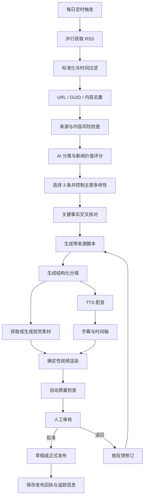

# AI 视频日报参考卡带草案

> 状态：产品与流程设计稿，不代表当前卡带已经实现。
>
> 定位：CartridgeFlow 第一张参考级完整卡带，用一条范围克制但端到端真实的业务链，验证卡带设计、运行、交互、产物、恢复和外部发布能力。

## 1. 目标

AI 视频日报卡带每天从一组可信科技 RSS 中获取最新内容，完成去重、选题、事实核对、脚本与分镜生成、素材准备、配音、字幕、视频渲染、质量检查和发布。

这张卡带同时承担两个目标：

1. 交付一个真实可使用的自动科技视频日报产品；
2. 验证 CartridgeFlow 能否将复杂 AI 流程稳定封装成可追踪、可恢复、可发布的完整卡带。

## 2. “完整”的定义

第一版采用“纵向完整、横向克制”的原则。

纵向完整表示必须贯通：

```text
来源
  -> 决策
  -> 内容生产
  -> 媒体生产
  -> 质量审核
  -> 人工批准
  -> 发布
  -> 回执与追踪
```

横向克制表示第一版不追求所有新闻领域、视觉风格、语言和发布平台。

## 3. 第一版产品范围

建议固定为：

```text
每天运行一次
+ 5 至 10 个可信科技 RSS
+ 每期选择 3 条新闻
+ 60 至 90 秒中文视频
+ 1080 × 1920 竖屏格式
+ 一套固定视觉模板
+ 一种固定配音角色
+ 一个发布平台
+ 正式发布前人工确认
```

### 3.1 输入

- RSS 源列表；
- 抓取时间窗口，默认过去 24 小时；
- 关注主题与排除关键词；
- 目标语言和视频时长；
- 视觉模板和配音角色；
- 发布平台与计划发布时间；
- 单次运行模型和媒体生成预算。

### 3.2 输出

- 结构化新闻候选；
- 入选新闻与选择依据；
- 事实核对报告；
- 视频脚本与分镜；
- 素材、配音和字幕；
- 预览视频与最终视频；
- 人工审批记录；
- 平台发布回执。

## 4. 完整 Flow



## 5. 节点职责划分

| 阶段 | 主要职责 | 执行性质 |
|---|---|---|
| 定时触发 | 创建唯一日报运行，固定日期和时区 | 确定性 |
| RSS 获取 | 条件请求、限流、重试和原始响应保存 | 确定性 |
| 标准化 | 统一标题、时间、链接、作者和摘要 | 确定性 |
| 去重 | 使用 GUID、canonical URL 和内容哈希去重 | 确定性 |
| 来源检查 | 检查来源允许列表、时效和内容风险 | 确定性策略 |
| 新闻评分 | 判断重要性、相关性、新颖性和受众价值 | AI 决策 |
| 多样性选择 | 控制同一事件、公司和类别的占比 | AI 决策 + 硬约束 |
| 事实核对 | 提取关键陈述并与原文或第二来源比较 | AI 辅助 + 规则 |
| 脚本生成 | 生成口播稿、标题、来源引用和风险提示 | AI 生成 |
| 分镜生成 | 将脚本转换为结构化镜头计划 | AI 生成 |
| 素材处理 | 下载、生成、裁切并记录授权与来源 | 确定性 + 可选 AI |
| TTS | 按固定角色生成配音 | 外部模型调用 |
| 字幕 | 对齐脚本、音频和镜头时间 | 确定性 |
| 视频渲染 | 使用固定模板和渲染参数生成视频 | 确定性工具 |
| 自动 QA | 检查事实、版权、黑帧、静音、字幕和规格 | 规则 + AI 辅助 |
| 人工审核 | 批准、退回或取消发布 | 人工决策 |
| 平台发布 | 上传、设置元数据并查询真实状态 | 外部副作用 |

## 6. AI 与确定性执行边界

### 6.1 AI 负责

- 新闻价值、相关性和多样性判断；
- 相似事件聚合；
- 关键事实提取和矛盾提示；
- 标题、口播脚本和分镜生成；
- 风格调整和修订建议；
- 风险与不确定性提示。

### 6.2 确定性节点负责

- RSS 请求、缓存和限流；
- 时间过滤、URL 规范化和去重；
- 文件下载、格式转换和媒体探测；
- 字幕时间轴、分辨率、码率和音量检查；
- FFmpeg 或等价工具渲染；
- 平台认证、上传、幂等和状态查询；
- 事件、产物、错误和发布回执持久化。

AI 不得临场发明 RSS 地址、FFmpeg 参数或发布接口，也不得绕过来源、质量和审批门槛。

## 7. 来源与事实策略

### 7.1 来源分级

建议为每个 RSS 源配置等级：

- `primary`：公司公告、研究机构、政府和论文原文；
- `trusted_media`：具有编辑流程的专业媒体；
- `discovery_only`：聚合器、社区和线索来源，只用于发现，不作为唯一事实依据。

### 7.2 事实核对

每条入选新闻至少提取：

- 主体；
- 发生了什么；
- 时间；
- 数字与规格；
- 已确认事实；
- 推测或公司主张；
- 原始来源链接。

涉及安全事件、医疗、金融、政策或重大争议时，原则上需要第二个独立来源，或者明确标记为单方声明。

### 7.3 引用要求

- 视频描述必须包含原文链接；
- 脚本不能把推测写成已确认事实；
- 公司公告中的性能和市场主张必须注明来源主体；
- 无法核对的关键数字不得进入最终口播。

## 8. 素材与版权策略

每项视觉、音频和字体素材必须记录：

- 来源 URL 或生成任务；
- 作者或提供方；
- 授权类型；
- 下载或生成时间；
- 文件哈希；
- 允许的使用范围；
- 是否需要署名。

第一版优先使用：

- 自有模板；
- 明确许可的图片或视频；
- 官方新闻稿允许展示的媒体素材；
- 具有清晰生成记录的 AI 素材；
- 已获得商用授权的音乐和字体。

不能因为素材可以下载，就默认允许用于商业视频。

## 9. 产物谱系

每次运行至少产生并保留：

```text
raw_feed.json
normalized_articles.json
dedupe_report.json
selected_news.json
fact_check_report.json
script.md
storyboard.json
assets_manifest.json
voice.wav
subtitles.srt
render_manifest.json
preview.mp4
quality_report.json
approval.json
final.mp4
publication_receipt.json
```

最终视频必须能够追溯到新闻源、脚本 revision、素材、模型、工具、审批人与发布目标。

## 10. 自动质量门槛

进入人工审核前必须满足：

- 每条新闻都有有效原文链接；
- 标题、主体、日期和关键数字可以追溯；
- 没有把推测或营销主张写成事实；
- 素材授权信息完整；
- 视频不存在黑帧、损坏帧或异常长静止画面；
- 音轨存在且响度位于允许范围；
- 字幕不超出安全区域，时间轴与语音基本一致；
- 视频时长、尺寸、编码和文件大小符合平台要求；
- 本次运行不存在未解决的高风险错误；
- 发布幂等键尚未被成功消费。

质量门槛失败必须阻止发布，不能自动降级为看似成功的结果。

## 11. 人工审核与发布

第一阶段采用：

```text
生成最终预览
  -> 自动质量检查
  -> 上传为草稿或保持本地
  -> 人工审核
  -> 明确批准
  -> 正式发布
```

审核界面应同时展示：

- 视频预览；
- 入选新闻与原文；
- 脚本和关键事实；
- 素材授权状态；
- 自动 QA 结果；
- 预计发布平台和时间。

人工可以批准、退回修订或取消。退回必须携带结构化反馈，形成新的 script、storyboard 或 render revision。

## 12. 发布副作用与恢复

正式发布属于不可安全重放的外部副作用。平台需要：

- 使用 `date + edition + platform + account` 生成发布幂等键；
- 上传超时后先查询平台状态，不能直接再次上传；
- 区分草稿创建、媒体上传、处理完成和正式公开；
- 保存平台内容 ID、URL、发布时间和响应摘要；
- 重试前确认是否已经创建内容；
- 删除或撤回只能作为补救动作，不能被当作真正回滚。

## 13. 成本与运行指标

每次运行应记录：

- RSS 请求数、命中缓存数和失败源；
- 候选、去重后和入选新闻数量；
- 各模型的 token、调用次数、延迟和费用；
- TTS、图片生成和渲染成本；
- 总运行时间和各阶段耗时；
- 人工修改次数和审核耗时；
- 发布成功率、重复发布拦截数和失败原因。

第一版目标不是最低成本，而是得到真实的单期成本和质量基线。

## 14. 版本演进

### V0：内容验证

交付 `selected_news.json`、`fact_check_report.json`、`script.md` 和 `storyboard.json`。人工判断选题、事实和文案是否有持续价值。

进入 V1 的条件：连续 7 次运行都能产生可用脚本，且主要问题不是来源或事实错误。

### V1：视频闭环

真实生成 `final.mp4`，由人工下载并手动发布。重点验证视频质量、素材流程、耗时和成本。

进入 V2 的条件：连续 10 期无需手工重新制作视频，渲染和媒体错误可以在工作台中定位。

### V2：半自动发布

系统上传草稿，用户在工作台审核后正式发布。加入发布幂等、回执、超时查询和失败恢复。

进入 V3 的条件：发布链稳定，来源、版权和质量门槛经过真实使用验证。

### V3：受控自动发布

只有满足来源、事实、版权、质量和风险策略的内容才能自动发布。不确定内容继续进入人工审核。

### V4：多平台扩展

在单平台稳定后，再支持不同画幅、时长、标题、标签、封面和发布接口。各平台使用独立 Connector Binding，不在卡带 Flow 中硬编码平台细节。

## 15. 第一版验收标准

- 能从真实 RSS 获取并保存原始数据；
- 能对过去 24 小时内容完成规范化和去重；
- 能选出 3 条具有来源说明的科技新闻；
- 能生成可追溯脚本、分镜、配音、字幕和视频；
- 能阻止来源、版权或视频质量不合格的结果进入发布；
- 能在人工批准后完成一次真实发布；
- 超时或重复触发不会产生重复公开内容；
- 任一阶段失败都保留稳定错误、运行事件和恢复入口；
- 最终发布内容可以追溯到完整产物链。

## 16. 第一版非目标

- 支持所有新闻领域和语言；
- 同时发布到多个平台；
- 每期动态生成全新视觉风格；
- 全自动处理高风险争议新闻；
- 自动使用来源不明的图片、音乐或视频；
- 建设推荐算法、账号矩阵和增长系统；
- 用大量 fallback 保证每天看似都有视频；
- 在尚未验证单平台闭环前追求无人值守。

## 17. 尚未决定的问题

- 第一发布平台及其草稿、审核和回调能力；
- 视频模板采用 FFmpeg、Remotion 还是其他确定性渲染器；
- 配音提供方、声音授权和模型替换策略；
- 新闻图片采用授权素材、截图、信息图还是生成素材；
- 事实核对所需的最低独立来源数量；
- 哪些新闻类别必须始终人工审核；
- 最长允许运行时间和单期成本上限；
- 视频删除、修正和重新发布的公开策略。

## 18. 当前结论

AI 视频日报应当成为参考级完整卡带，但完整指的是来源、决策、生产、审核、发布和追踪全部贯通，不是第一版就覆盖所有来源、样式和平台。

第一版先证明一件事：CartridgeFlow 能把一组不稳定的外部信息和模型能力，转化为一份来源清楚、质量受控、可由人批准并安全发布的视频产物。这个闭环稳定后，再逐步减少人工、扩展平台和提高自动化程度。
