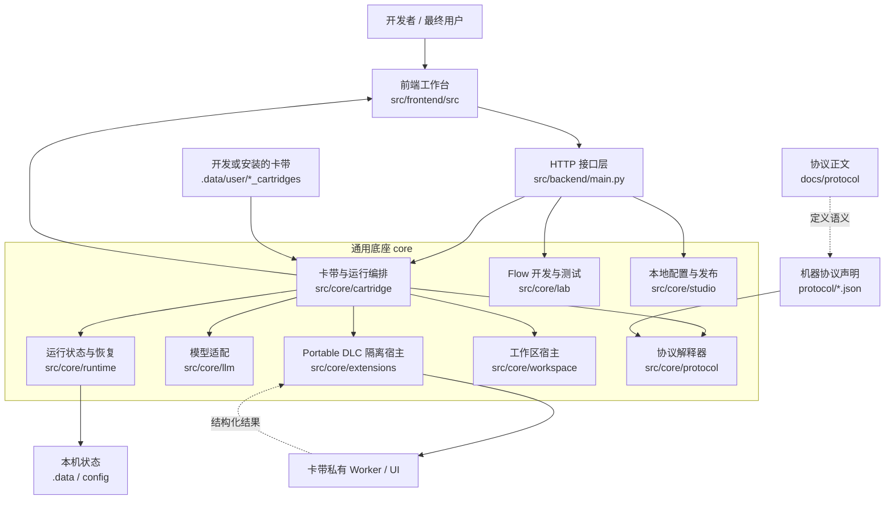
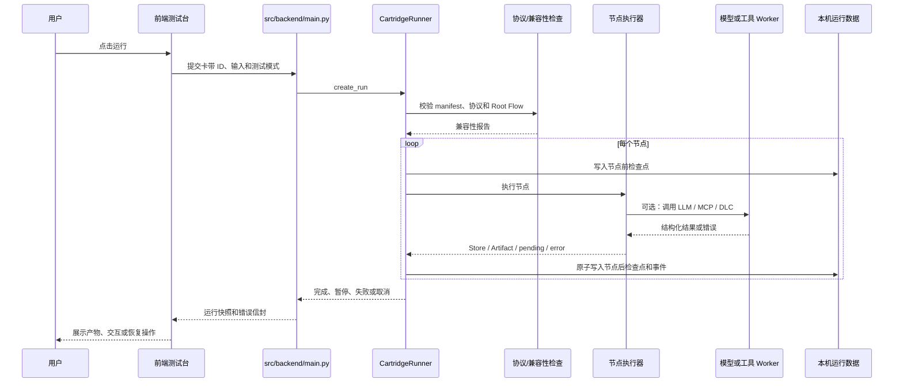
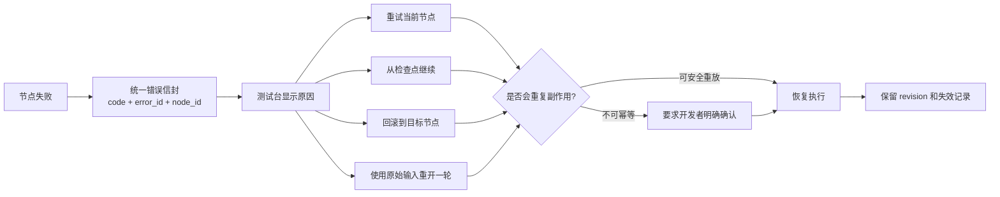

# CartridgeFlow 项目分层说明

这份文档只回答三个问题：这个项目是什么、一次操作如何穿过各层、改需求时应该去哪里找代码。它是全局导览，不替代专项架构约束。文档总入口见 [文档索引](../README.md)，逐文件用途见 [FILE_INVENTORY.md](../development/FILE_INVENTORY.md)。

## 一句话理解

CartridgeFlow 不是某个视频工具，也不是某张卡带。它更像一个可以安装、运行和排查 AI 工作流应用的“通用底座”。

- **卡带**负责具体业务，例如网站介绍视频、素材清洗或 3D 工作流。
- **底座**负责打开卡带、检查兼容性、执行流程、调用模型和工具、暂停等用户、保存产物、处理失败与恢复。
- **协议**规定卡带和底座之间怎么说话，避免每张卡带都要求修改底座。

## 总体结构图



## 七层大白话

### 1. 页面层：人操作的地方

目录：`src/frontend/`

这里负责把数据画出来，也负责收集按钮、表单和拖拽操作。它不应该自己决定流程是否成功，更不能绕过后端直接篡改运行结果。

可以把它理解成“驾驶舱”：显示速度、故障和路线，但发动机不在这里。

### 2. 接口层：前后端总机

文件：`src/backend/main.py`

这里把浏览器请求转交给正确的核心模块，并把结果统一包装成 HTTP 响应。它可以做参数检查和错误转换，但不应该塞进具体业务规则。

可以把它理解成“前台总机”：知道电话该转给谁，但不替部门完成工作。

### 3. 卡带与运行层：真正的流程调度中心

目录：`src/core/cartridge/`、`src/core/runtime/`

这一层负责：

- 找到并校验卡带；
- 检查卡带和当前底座是否兼容；
- 按 Root Flow 顺序运行节点；
- 保存运行事件、Store、Artifact 和检查点；
- 失败时生成统一错误，重试、恢复或回滚；
- 取消时终止关联 Worker。

可以把它理解成“车间调度员 + 黑匣子”。

### 4. 开发工作台层：给 Flow 开发者用的工具

目录：`src/core/lab/`、`src/core/studio/`

`lab` 负责创建和编辑 Flow、分析结构、执行单节点、探针测试和通用 MCP。`studio` 负责本地资源、环境变量、发布预检和源码卫生检查。

它们是开发工具，不是最终卡带的业务实现。

### 5. 能力适配层：连接模型、工具和工作区

目录：`src/core/llm/`、`src/core/extensions/`、`src/core/workspace/`

- `llm` 把不同模型服务统一成一套调用方式；
- `extensions` 校验卡带自带 DLC，并在隔离 Worker/iframe 中执行；
- `workspace` 管理卡带需要打开的本地工作区。

可以把它理解成“插座转换器”：底座只认统一接口，外部能力各自适配。

### 6. 协议治理层：规定什么才算合法

目录：`protocol/`、`docs/protocol/`、`src/core/protocol/`、`config/base/BASE_IMPLEMENTATION.json`

这里分四种东西：

| 内容 | 作用 |
|---|---|
| `docs/protocol/` | 人读的规则正文 |
| `protocol/*.json` | 机器读的协议、能力、profile 和 tool pack 身份 |
| `src/core/protocol/` | 把规则变成校验与兼容性报告的代码 |
| `config/base/BASE_IMPLEMENTATION.json` | 当前这个底座实际做到了哪些能力 |

已发布协议是只读快照。实现有 bug 就修实现；语义要变化就发布新协议版本。

### 7. 本机数据与生成物：能删、能重建、不能当源码

目录：`.data/`、`.tools/`、`src/frontend/node_modules/`、`src/frontend/dist/`、缓存与日志。

`.data/` 按生命周期分区：`user/` 必须保留和备份，`runtime/` 保存运行与恢复状态，`reports/` 保存可查看和轮转的日志与报告，`temp/` 保存可清理缓存。它们不属于正式源码，默认不进入版本库。

## 一次运行怎么走



## 失败和恢复怎么走



## 目录边界

```text
CartridgeFlow-main/
├─ src/                      产品源码集中区
│  ├─ core/                 通用后端能力，不能出现某张卡带的业务代码
│  ├─ backend/              HTTP 总入口
│  └─ frontend/             通用开发者工作台和 DLC 宿主
│     ├─ src/               前端源码
│     └─ dist/              可重新生成的生产构建
├─ protocol/             机器可读协议 registry
├─ docs/                 项目文档总入口
│  ├─ overview/          项目与系统的全局导览
│  ├─ development/       维护入口、文件清单、AI 参考和可选 Skill
│  ├─ planning/          项目目标和路线图
│  ├─ architecture/      专项架构决策和设计约束
│  └─ protocol/          当前协议、历史快照和治理规则
├─ scripts/               不随产品交付的可执行维护区
│  ├─ bootstrap.ps1       安装项目本地开发环境
│  ├─ launch.py           启动前后端开发服务
│  ├─ run_conformance.py  运行完整自动验证
│  └─ tests/              当前协议、运行、Studio、LLM、卫生和历史测试
├─ config/               可提交的基座配置
│  ├─ base/             能力声明和测试证据
│  ├─ defaults/         实际生效的出厂默认策略
│  └─ templates/        本机配置的安全空白模板
├─ .data/                本机数据，不进版本库
│  ├─ user/              Flow、卡带、包、私有配置、数据和用户产物
│  │  └─ config/         模型、凭据、工具和数据来源的本机配置
│  ├─ runtime/           运行、检查点和 Worker 状态
│  ├─ reports/           服务日志、错误报告和 conformance 报告
│  └─ temp/              上传与导入缓存
└─ .tools/               自动生成的本地开发工具，不进版本库
   ├─ runtimes/
   │  ├─ python/         后端与工程脚本使用的 Python
   │  └─ node/           前端开发与构建使用的 Node.js
   └─ downloads/        安装包下载缓存
```

## 改需求时去哪里

| 需求 | 首先查看 |
|---|---|
| 页面布局、侧栏、测试台 | `src/frontend/src/` |
| 新增或修改 HTTP API | `src/backend/main.py`，再追到对应 `src/core/` 模块 |
| 卡带安装、发现、运行和回滚 | `src/core/cartridge/` |
| 节点动作、探针、Flow 编辑 | `src/core/lab/` |
| 错误码、检查点、状态迁移 | `src/core/runtime/` |
| 模型连接与 Responses/Chat API | `src/core/llm/` |
| 卡带私有工具或 UI | 卡带自己的 `dlc/`，宿主代码在 `src/core/extensions/` |
| 协议规则 | 先读 `docs/protocol/`，实现位于 `src/core/protocol/` |
| 本地模型、工具、数据源配置 | `src/core/studio/`、`config/`、对应前端页面 |
| 发布和源码卫生 | `src/core/studio/release.py`、`src/core/studio/hygiene.py` |

## 这次清理做了什么

| 清理项 | 原因 |
|---|---|
| `desktop_app.py` | 旧 PyWebView 桌面壳；启动脚本和依赖均不再使用 |
| `src/core/runtime/coding.py` | 从未注册到 `RuntimeManager`，没有调用入口 |
| `src/core/runtime/base.py` | 未被任何 Runtime Adapter 继承的旧基类 |
| `src/core/workspace/base.py` | 未被 WorkspaceHostManager 使用的旧基类 |
| `src/frontend/src/pages/flow-workbench/AdvancedPanels.tsx` | 已被当前 Flow 工作台替代的旧高级面板 |
| `src/frontend/src/pages/flow-workbench/cards.tsx` | 只服务于已删除旧高级面板的组件 |
| `src/frontend/src/pages/flow-workbench/NodeEditor.tsx` | 没有任何页面入口，节点编辑已由 `NodeDrawer.tsx` 承担 |
| `src/frontend/public/icons.svg` | 未被页面引用的旧社交图标精灵 |
| `src/frontend/src/App.css` | 只有一行注释且从未导入 |
| `src/frontend/src/assets/hero.png` | 无引用的旧视觉素材 |
| `src/frontend/src/assets/react.svg` | Vite 初始模板资源，无引用 |
| `src/frontend/src/assets/vite.svg` | Vite 初始模板资源，无引用 |
| `cartridges/README.md` | 空占位目录会让人误以为它是运行时卡带入口；真实入口统一为 `.data/user/*_cartridges/` |
| `temp/`、旧 `.data/logs/`、根目录旧 `.studio-*.log` | 已迁移或清除的截图审计、调试和服务日志生成物 |
| `.pytest_cache/`、`__pycache__/` | 测试和 Python 字节码缓存 |

本次没有删除 `.data/`、本地模型/凭据配置、`.tools/`、`node_modules/` 或 `src/frontend/dist/`，因为它们分别承载用户本机状态、开发环境和当前可运行构建。

## 三条最重要的判断规则

1. 删除一张卡带后仍然有通用价值的代码，才可能属于底座。
2. 页面只能提交意图，运行状态必须由后端 Runner 决定并持久化。
3. 没有测试证据的能力只能标记为 `partial`，不能因为“看起来能用”就宣称完成。
