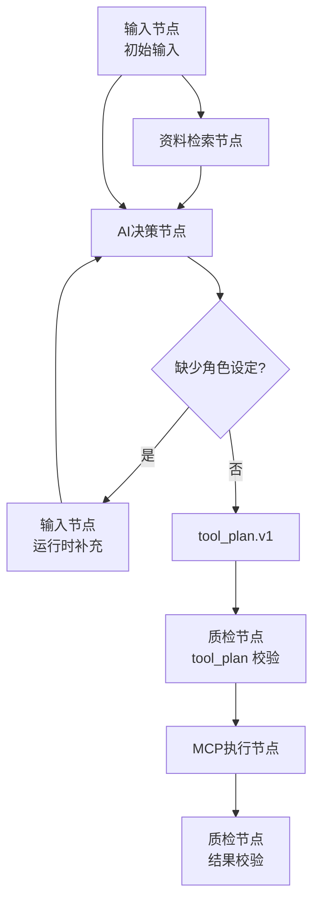
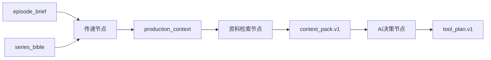

# CartridgeFlow Flow Authoring and Runtime Protocol v0.2

协议编号：CF-FARP-0.2

协议状态：draft

发布日期：2026-07-16

本文是 `CF-FARP-0.2` 的完整协议草案。本文完整替代 `CF-FARP-0.1` 的流程搭建与运行协议正文；后续实现、讨论和迁移不应要求阅读 v0.1 才能理解 v0.2。v0.1 只作为历史留档和已认证卡带的兼容解释来源。

---

## 目录

1. [协议定位](#1-协议定位)
2. [设计目标](#2-设计目标)
3. [规范关键词](#3-规范关键词)
4. [实体定义](#4-实体定义)
5. [协议版本与认证标签](#5-协议版本与认证标签)
6. [基座与协议分离](#6-基座与协议分离)
7. [卡带包结构](#7-卡带包结构)
8. [Manifest 契约](#8-manifest-契约)
9. [Runtime Contract](#9-runtime-contract)
10. [Delivery Readiness](#10-delivery-readiness)
11. [Root Flow 结构](#11-root-flow-结构)
12. [节点通用规则](#12-节点通用规则)
13. [节点统一模型](#13-节点统一模型)
14. [用户层显示规则](#14-用户层显示规则)
15. [协议层字段](#15-协议层字段)
16. [Kind 规则](#16-kind-规则)
17. [Executor 规则](#17-executor-规则)
18. [Effect 规则](#18-effect-规则)
19. [输入类处理节点](#19-输入类处理节点)
20. [决策与工具计划](#20-决策与工具计划)
21. [MCP 与 Remote 处理节点](#21-mcp-与-remote-处理节点)
22. [数据链与 Store](#22-数据链与-store)
23. [tool_plan.v1 契约](#23-tool_planv1-契约)
24. [工具、MCP 与能力声明](#24-工具mcp-与能力声明)
25. [Artifact 与 Delivery](#25-artifact-与-delivery)
26. [错误、失败与回退](#26-错误失败与回退)
27. [测试台与探针](#27-测试台与探针)
28. [兼容性报告](#28-兼容性报告)
29. [认证要求](#29-认证要求)
30. [UI 显示分层](#30-ui-显示分层)
31. [迁移规则](#31-迁移规则)
32. [示例](#32-示例)

---

## 1. 协议定位

CF-FARP-0.2 定义 CartridgeFlow 卡带的流程搭建、流程运行、节点语义、输入输出、工具调用、动态决策、产物交付和认证要求。

本协议面向两类基座：

- 开发基座：支持搭建、调试、探针、诊断和认证。
- 生产基座：不一定支持设计台，但必须能解释并运行其声明支持的协议能力。

v0.2 的核心定位是：

```text
可认证的动态决策流程协议
```

它允许：

- 多次输入。
- AI 决策。
- RAG / 检索。
- MCP 工具调用。
- AI 通过结构化计划驱动工具。
- UI 用用户友好的后缀展示节点。

同时它禁止：

- AI 无边界直接执行副作用。
- 工具绕过 schema 和权限校验。
- UI 显示名称替代协议语义。
- 为单个卡带临时放宽协议。

---

## 2. 设计目标

v0.2 必须满足：

1. 单个卡带不应反向污染协议。
2. 协议必须能完整阅读，不依赖 v0.1。
3. 用户可理解为“输入、处理、决策、执行、质检、交付”。
4. 实现层必须保留副作用边界。
5. AI 决策必须可被校验、可被限制、可被复现到日志中。
6. RAG / 检索与纯数据传递可以在 UI 上同属处理节点，但协议上必须用后缀区分行为。
7. MCP 不强制绑定 AI，也不得被 AI 无限制调用。

---

## 3. 规范关键词

本文使用以下关键词：

- MUST：必须。
- MUST NOT：不得。
- SHOULD：应当。
- SHOULD NOT：不应。
- MAY：可以。

---

## 4. 实体定义

### 4.1 Protocol

协议定义卡带可移植语义。

### 4.2 Base

基座是协议的具体实现。

基座必须声明：

- 支持的协议版本。
- 支持的 profile。
- 支持的 capability。
- 支持的 tool pack。

### 4.3 Cartridge

卡带是可分发的流程包。

卡带至少包含：

- `manifest.json`
- `root.flow.json`

### 4.4 Root Flow

Root Flow 是卡带的流程图定义。

### 4.5 Node

Node 是流程图中的执行单元。

### 4.6 Store

Store 是单次运行内的数据上下文。

### 4.7 Tool

Tool 是具备明确输入、输出和副作用声明的能力。

### 4.8 MCP

MCP 是工具能力的一种提供方式，不等同于 AI。

---

## 5. 协议版本与认证标签

v0.2 的协议标识：

```text
CF-FARP@0.2
```

v0.2 认证标签：

```text
cf-farp-0-2-certified
```

认证标签只能在认证报告通过后添加。

卡带如果只按 v0.1 认证，不得声称 v0.2 认证。

---

## 6. 基座与协议分离

协议不得绑定具体基座实现。

基座可以支持协议的一部分，但必须如实声明：

```json
{
  "id": "CF-FARP",
  "version": "0.2",
  "status": "partial"
}
```

如果基座未声明支持 `CF-FARP@0.2`，不得运行要求 v0.2 能力的通用卡带，除非进入开发兼容模式并明确标记不可认证。

---

## 7. 卡带包结构

推荐结构：

```text
cartridge/
  manifest.json
  root.flow.json
  assets/
  prompts/
  schemas/
  tests/
```

卡带不得依赖包外未声明资源。

卡带可以引用外部服务，但必须通过 manifest 声明依赖、权限、工具和失败策略。

---

## 8. Manifest 契约

manifest 必须声明：

```json
{
  "id": "example.cartridge",
  "version": "0.1.0",
  "base_contract": {
    "id": "CF-FARP",
    "version": "0.2"
  },
  "runtime_contract": {},
  "delivery_readiness": {},
  "root_flow": {
    "entry": "root.flow.json"
  }
}
```

manifest 应声明：

- inputs
- outputs
- mcp_tools
- artifacts
- delivery
- dependencies
- permissions

---

## 9. Runtime Contract

runtime contract 声明卡带运行所需的协议能力。

示例：

```json
{
  "protocol": "CF-FARP",
  "protocol_version": "0.2",
  "required_profiles": ["runtime_core", "dynamic_decision_runtime"],
  "required_capabilities": [
    "root_flow_execution",
    "unified_process_node",
    "multi_input_node",
    "process_node_kind_parse",
    "process_effect_contract",
    "decision_process",
    "tool_plan_validate"
  ],
  "required_tools": ["media_generate_pixel_shot_plan"]
}
```

runtime contract 是兼容性检查的输入，不是说明文案。

---

## 10. Delivery Readiness

卡带必须声明交付等级：

```text
dev
preview
production
```

`dev` 可以依赖开发台能力。

`preview` 必须可被普通用户运行。

`production` 必须避免开发专用工具、未声明外部依赖和未隔离实验支线。

---

## 11. Root Flow 结构

Root Flow 必须包含：

```json
{
  "schema_version": "1.0",
  "id": "example.root",
  "name": "Example Root Flow",
  "mode": "lifecycle",
  "cartridge_id": "example.cartridge",
  "protocol": {
    "id": "CF-FARP",
    "version": "0.2"
  },
  "start": "start",
  "states": {},
  "edges": []
}
```

`start` 必须指向存在节点。

生产态主链必须能到达 terminal 节点。

layout 只用于展示，不得决定执行顺序。

---

## 12. 节点通用规则

节点必须职责单一。

节点不得在同一节点中混合：

- 用户输入。
- AI 决策。
- RAG / 检索。
- 数据传递。
- 工具执行。
- 远程调用。
- UI 展示。
- 持久状态写入。

节点应声明：

```json
{
  "id": "node_id",
  "type": "process",
  "title": "Node Title",
  "input": "input_key",
  "output": "output_key"
}
```

---

## 13. 节点统一模型

v0.2 采用分层节点模型。

用户层只有一个主要业务节点：

```text
处理节点
```

用户通过后缀理解节点实际用途：

```text
输入节点
传递节点
RAG检索节点
MCP检索节点
AI决策节点
MCP执行节点
质检节点
展示节点
人工确认节点
交付节点
```

协议层使用字段约束实际行为：

```json
{
  "type": "process",
  "kind": "input | transfer | retrieval | decision | transform | validation | routing | mcp_read | mcp_execute | remote_call | gate | ui | human_gate | delivery",
  "executor": "user | deterministic | rules | rag | llm | mcp | remote | human | plugin",
  "effect": "none | read_only | writes_store | writes_artifacts | writes_files | mutates_state | external_side_effect"
}
```

`system` 和 `terminal` 仅作为生命周期节点保留，不属于用户业务节点分类。

---

## 14. 用户层显示规则

UI 必须优先显示“后缀 + 节点”，例如“AI决策节点”“MCP执行节点”；不得把协议字段直接暴露成一堆用户不可理解的节点类型。

推荐显示映射：

```text
kind=input         输入节点
kind=transfer      传递节点
kind=retrieval     RAG检索节点 / 资料检索节点
kind=mcp_read      MCP检索节点 / MCP处理节点
kind=decision      AI决策节点
kind=mcp_execute   MCP执行节点
kind=remote_call   远程执行节点
kind=gate          质检节点
kind=ui            展示节点
kind=human_gate    人工确认节点
kind=delivery      交付节点
```

用户可以只关注后缀；运行时和认证必须读取协议字段。

---

## 15. 协议层字段

所有业务节点应使用：

```json
{
  "type": "process",
  "kind": "decision",
  "executor": "llm",
  "effect": "none",
  "input": "context_pack",
  "output": "tool_plan",
  "output_contract": "tool_plan.v1"
}
```

### 15.1 type

`type` 表示协议硬类型。

v0.2 业务节点统一使用：

```text
process
```

### 15.2 kind

`kind` 表示这个处理节点实际在做什么。

### 15.3 executor

`executor` 表示使用什么执行机制。

### 15.4 effect

`effect` 表示节点是否产生副作用，以及副作用等级。

### 15.5 display

`display` 可以声明 UI 后缀：

```json
{
  "display": {
    "label": "AI决策节点",
    "suffix": "AI决策"
  }
}
```

display 不得作为运行语义来源。

---

## 16. Kind 规则

### 16.1 input

`kind=input` 负责把某一批输入写入 store。

input 可以出现多次。

input 不等于唯一入料口。

manifest inputs 是输入 schema 注册表，不是唯一输入时机。

必须声明：

```json
{
  "type": "process",
  "kind": "input",
  "executor": "user",
  "effect": "writes_store",
  "input_kind": "initial | runtime | confirmation | correction | selection",
  "source": "manifest | user_form | user_prompt | event | external",
  "output": "store_key"
}
```

### 16.2 transfer

`kind=transfer` 只能搬运、合并、重命名、选择已有 store 数据。

它必须是：

```json
{
  "executor": "deterministic",
  "effect": "writes_store"
}
```

它不得检索、判断、调用 LLM、调用 MCP、写文件、改持久状态。

### 16.3 retrieval

`kind=retrieval` 负责 RAG / 资料检索 / 上下文包整理。

允许 effect：

```text
none
read_only
writes_store
```

推荐输出：

```text
context_pack.v1
```

### 16.4 decision

`kind=decision` 负责 AI 决策、规划、选择、路由或生成结构化决策。

AI 节点应表达为：

```json
{
  "type": "process",
  "kind": "decision",
  "executor": "llm",
  "effect": "none"
}
```

decision 如果要驱动工具，必须输出 `tool_plan.v1` 或协议等价结构。

### 16.5 mcp_read

`kind=mcp_read` 表示通过 MCP 做只读处理。

允许：

- 只读检索资料。
- 查询状态。
- 调用无副作用分类、摘要、校验服务。

必须声明：

```json
{
  "executor": "mcp",
  "effect": "read_only",
  "mcp_binding": {
    "mode": "read_only",
    "allowed_tools": ["knowledge_search"]
  }
}
```

### 16.6 mcp_execute

`kind=mcp_execute` 表示通过 MCP 执行有副作用动作。

包括：

- 写文件。
- 移动文件。
- 修改数据库。
- 修改卡带资产。
- 渲染媒体。
- 发布内容。
- 创建 artifact。
- 改变世界状态或项目状态。

必须声明：

```json
{
  "executor": "mcp",
  "effect": "writes_artifacts | writes_files | mutates_state | external_side_effect",
  "tool_binding": "static_params | store_params | from_tool_plan | hybrid_params",
  "allowed_tools": ["tool_id"]
}
```

### 16.7 remote_call

`kind=remote_call` 表示调用外部远程服务。

必须声明 endpoint、timeout、权限、数据传输范围、失败策略和是否 isolated。

### 16.8 gate

`kind=gate` 表示质检、门禁、策略检查或中断判断。

必须返回结构化结果：

```json
{
  "passed": true,
  "issues": [],
  "severity": "info | warning | blocker"
}
```

### 16.9 ui

`kind=ui` 表示展示。

如果要收集输入，应使用 `kind=input`。

### 16.10 human_gate

`kind=human_gate` 表示人工确认、选择或审批。

必须声明提示文本、可选动作、默认动作、超时策略和拒绝策略。

### 16.11 delivery

`kind=delivery` 表示交付汇总或交付出口。

delivery 不得引用未由流程产出的 required output。

---

## 17. Executor 规则

executor 允许值：

```text
user
deterministic
rules
rag
llm
mcp
remote
human
plugin
```

executor 不决定副作用等级，副作用必须由 `effect` 声明。

例如：

```json
{
  "kind": "mcp_read",
  "executor": "mcp",
  "effect": "read_only"
}
```

和：

```json
{
  "kind": "mcp_execute",
  "executor": "mcp",
  "effect": "writes_artifacts"
}
```

二者用户层都可以叫处理节点，但认证规则完全不同。

---

## 18. Effect 规则

effect 表示节点是否改变流程外部或持久状态。

允许值：

```text
none
read_only
writes_store
writes_artifacts
writes_files
mutates_state
external_side_effect
```

### 18.1 无副作用

`none` 表示只计算、判断、整理，不写 store 以外的状态。

### 18.2 只读

`read_only` 表示可以读取外部资料或查询外部状态，但不得修改外部状态。

### 18.3 写 store

`writes_store` 表示只写本次运行 store。

### 18.4 写 artifact / 文件 / 状态

以下 effect 必须受到更严格校验：

```text
writes_artifacts
writes_files
mutates_state
external_side_effect
```

这类节点必须声明工具、权限、参数 schema、失败策略和日志记录。

---

## 19. 输入类处理节点

多输入通过 `kind=input` 表达。

示例：

```json
{
  "type": "process",
  "kind": "input",
  "executor": "user",
  "effect": "writes_store",
  "input_kind": "runtime",
  "source": "user_form",
  "input_schema": "character_patch.v1",
  "output": "character_patch"
}
```

生产基座如果不支持 runtime input，不得认证依赖 runtime input 的卡带。

---

## 20. 决策与工具计划

AI 决策通过 `kind=decision` 表达。

AI 不直接执行副作用。

如果 AI 决策要驱动 MCP 执行，必须输出 `tool_plan.v1`，再由 `kind=gate` 校验，再由 `kind=mcp_execute` 执行。


---

## 21. MCP 与 Remote 处理节点

MCP 不强制绑定 AI。

MCP 可以有两种处理节点：

```text
MCP检索节点  kind=mcp_read     effect=read_only
MCP执行节点  kind=mcp_execute  effect=writes_artifacts / mutates_state / external_side_effect
```

如果无法证明 MCP 是只读或无副作用，必须使用 `kind=mcp_execute`。

remote 服务如果只是工具提供方，可以通过 `kind=mcp_execute` 表达；如果远程服务本身是流程边界，使用 `kind=remote_call`。

---

## 22. 数据链与 Store

所有关键节点必须声明 input/output 或协议等价字段。

节点读取 store 中不存在的 required input，必须记录为数据链断裂。

可选输入必须显式声明。

运行时不得静默吞掉 required input 缺失。

---

## 23. tool_plan.v1 契约

`tool_plan.v1` 是 `kind=decision` 处理节点驱动 `kind=mcp_execute` 或其他受控执行处理节点的标准结构。

最小结构：

```json
{
  "schema": "tool_plan.v1",
  "tool_id": "media_generate_pixel_shot_plan",
  "params": {
    "episode_id": "ep_004",
    "shot_count": 4
  },
  "reason": "用户要求四镜头悬念推进。",
  "expected_output": "shot_plan_json",
  "failure_policy": "fail_closed"
}
```

必需字段：

- `schema`
- `tool_id`
- `params`
- `expected_output`
- `failure_policy`

`tool_id` 必须在 manifest 工具声明中存在，并被执行该计划的处理节点 `allowed_tools` 允许。

`params` 必须符合工具参数 schema。

AI 生成的 params 不得绕过 schema 校验。

---

## 24. 工具、MCP 与能力声明

工具不是用户层节点类型。

工具是被 `kind=mcp_read`、`kind=mcp_execute`、`kind=remote_call` 或插件型处理节点绑定的执行能力。

manifest 中的工具声明必须包含：

- id
- type
- server
- tool
- required
- contract
- params_schema
- output schema 或等价说明

required 工具必须声明 contract：

```json
{
  "capability": "builtin_tool_call",
  "idempotent": true,
  "side_effect": "none",
  "timeout_ms": 30000
}
```

基座必须声明支持的 tool pack。

如果工具会产生副作用，绑定它的处理节点必须使用对应的 `effect`，不得以 UI 名称或只读后缀降低副作用等级。

---

## 25. Artifact 与 Delivery

artifact 是运行产物。

卡带必须声明允许的 artifact 类型。

delivery 必须声明主输出：

```json
{
  "type": "summary_with_artifacts",
  "primary_output": "episode_delivery"
}
```

delivery 不得引用未由流程产出的 required output。

---

## 26. 错误、失败与回退

每个可能失败的节点必须声明失败策略。

允许策略：

```text
fail_closed
ask_user
fallback_static
skip_optional
retry
```

生产态有副作用处理节点默认应 fail_closed。

AI 输出校验失败不得自动执行工具。

---

## 27. 测试台与探针

测试台必须支持：

- 结构检查。
- 数据链检查。
- 节点探针。
- 工具参数预检。
- tool_plan 校验。
- 运行时输入模拟。
- kind / executor / effect 一致性检查。

探针不得把局部补的占位输入伪装成真实数据链通过。

---

## 28. 兼容性报告

兼容性报告必须检查：

- 协议版本是否已注册。
- 基座是否声明支持该协议。
- profile 是否满足。
- capability 是否满足。
- required tool 是否存在。
- required tool pack 是否支持。
- root flow 是否有效。
- delivery readiness 是否有效。

v0.2 还必须检查：

- multi input 支持。
- unified process node 支持。
- kind / executor / effect 解析。
- process effect contract 校验能力。
- tool_plan 校验能力。
- dynamic decision runtime 能力。

---

## 29. 认证要求

v0.2 认证必须满足：

1. manifest 声明 `base_contract`。
2. manifest 声明 `runtime_contract`。
3. manifest 声明 `delivery_readiness`。
4. root flow 声明 `protocol=CF-FARP@0.2` 或等价来源。
5. 除 `system`、`terminal` 等生命周期节点外，所有业务节点使用 `type=process`。
6. 所有 `type=process` 节点声明 `kind`、`executor` 和 `effect`。
7. `kind=input` 声明 `input_kind`、`source`、`input_schema` 或等价 schema 来源，并声明 `output`。
8. `kind=transfer` 只能使用 `executor=deterministic` 或等价确定性执行器，且不得检索、调用 AI、调用 MCP、写文件或产生持久副作用。
9. `kind=retrieval` 与 `kind=mcp_read` 的外部只读访问能力已声明。
10. `kind=decision` 驱动工具时输出 `tool_plan.v1` 或协议等价结构。
11. `kind=mcp_execute` 声明 `tool_binding`、`allowed_tools`、工具参数 schema、失败策略和日志要求。
12. tool_plan 执行前经过 schema、allowed_tools、权限和 effect 校验。
13. 任何高于 `read_only` 的 `effect` 都必须声明权限、失败策略和审计日志。
14. 兼容性报告无 blocker、无 warning。

认证标签：

```text
cf-farp-0-2-certified
```

---

## 30. UI 显示分层

协议字段是运行语义来源。

UI 显示名称只服务用户理解。

推荐显示映射：

```text
kind=input        输入节点
kind=transfer     传递节点
kind=retrieval    RAG检索节点 / 资料检索节点
kind=mcp_read     MCP检索节点 / MCP处理节点
kind=decision     AI决策节点
kind=mcp_execute  MCP执行节点
kind=remote_call  远程执行节点
kind=gate         质检节点
kind=ui           展示节点
kind=human_gate   人工确认节点
kind=delivery     交付节点
```

用户可以只关注后缀，但认证和运行必须读取协议字段。

---

## 31. 迁移规则

v0.1 卡带迁移到 v0.2 时应重建协议表达，不应依赖 v0.1 文档。

建议顺序：

1. 保留 v0.1 认证记录。
2. 建立 v0.2 root flow 草案。
3. 把旧 input / transfer / retrieval / decision / tool / gate / ui / delivery 等业务节点统一改为 `type=process`。
4. 为每个处理节点补充 `kind`、`executor`、`effect`。
5. 把旧 transfer 节点表达为 `kind=transfer, executor=deterministic, effect=writes_store`。
6. 把 RAG / 检索能力表达为 `kind=retrieval` 或 `kind=mcp_read`。
7. 把真实 AI 判断表达为 `kind=decision, executor=llm, effect=none`。
8. 给 AI 驱动工具的位置增加 `tool_plan.v1`。
9. 把有副作用的 MCP / 工具执行表达为 `kind=mcp_execute`，并补充 `tool_binding`、`allowed_tools`、权限和失败策略。
10. 增加 `kind=gate` 的 tool_plan 校验。
11. 重新跑兼容性和认证。

---

## 32. 示例

### 32.1 多输入 + 检索 + 决策 + MCP



### 32.2 处理节点后缀



三者都可以在用户界面归为处理类节点，但协议字段不同：

```json
[
  {"type": "process", "kind": "transfer", "executor": "deterministic", "effect": "writes_store"},
  {"type": "process", "kind": "retrieval", "executor": "rag", "effect": "read_only"},
  {"type": "process", "kind": "decision", "executor": "llm", "effect": "none"}
]
```

### 32.3 处理节点使用 MCP


判断规则：

```text
无副作用或只读 MCP -> MCP检索节点 / MCP处理
有副作用 MCP       -> MCP执行节点
```
