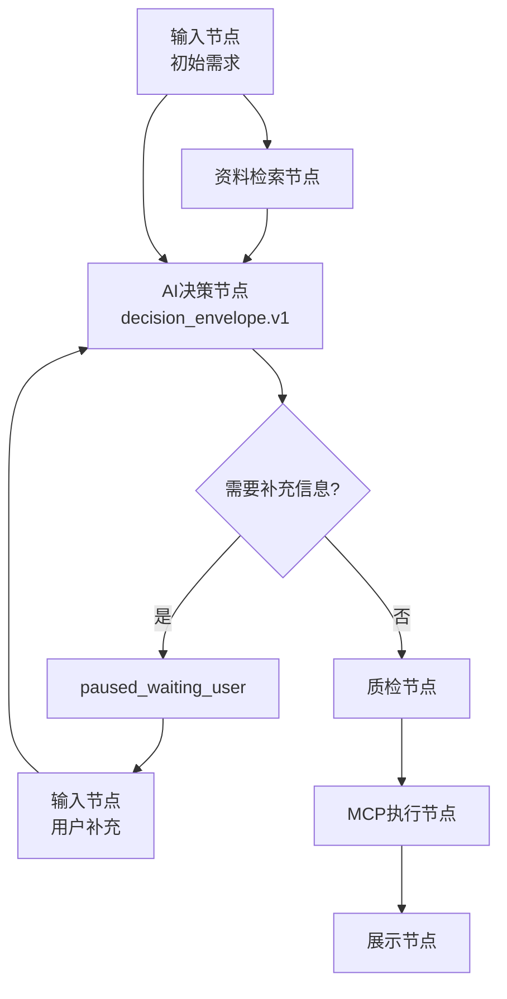
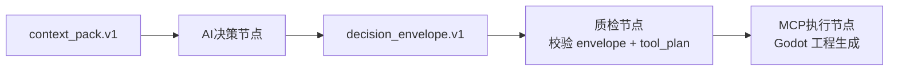

# CartridgeFlow Flow Authoring and Runtime Protocol v0.3

协议编号：CF-FARP-0.3

协议状态：active

发布日期：2026-07-17

本文是 `CF-FARP-0.3` 的完整协议正文。本文完整替代 `CF-FARP-0.2` 的流程搭建与运行协议正文；后续实现、讨论和迁移不应要求阅读 v0.1 或 v0.2 才能理解 v0.3。v0.1 与 v0.2 只作为历史留档、兼容解释和旧卡带认证来源。

---

## 目录

1. [协议定位](#1-协议定位)
2. [设计目标](#2-设计目标)
3. [规范关键词](#3-规范关键词)
4. [实体定义](#4-实体定义)
5. [协议版本与认证标签](#5-协议版本与认证标签)
6. [基座与协议分离](#6-基座与协议分离)
7. [卡带包结构](#7-卡带包结构)
8. [Manifest 契约](#8-manifest-契约)
9. [Runtime Contract](#9-runtime-contract)
10. [Delivery Readiness](#10-delivery-readiness)
11. [Root Flow 结构](#11-root-flow-结构)
12. [节点通用规则](#12-节点通用规则)
13. [节点统一模型](#13-节点统一模型)
14. [用户层显示规则](#14-用户层显示规则)
15. [协议层字段](#15-协议层字段)
16. [Kind 规则](#16-kind-规则)
17. [Executor 规则](#17-executor-规则)
18. [Effect 规则](#18-effect-规则)
19. [输入类处理节点](#19-输入类处理节点)
20. [AI 决策节点](#20-ai-决策节点)
21. [decision_envelope.v1 契约](#21-decision_envelopev1-契约)
22. [交互式暂停与恢复](#22-交互式暂停与恢复)
23. [LLM Provider 与测试模式](#23-llm-provider-与测试模式)
24. [决策与工具计划](#24-决策与工具计划)
25. [MCP 与 Remote 处理节点](#25-mcp-与-remote-处理节点)
26. [数据链与 Store](#26-数据链与-store)
27. [tool_plan.v1 契约](#27-tool_planv1-契约)
28. [工具、MCP 与能力声明](#28-工具mcp-与能力声明)
29. [Artifact 与 Delivery](#29-artifact-与-delivery)
30. [错误、失败与回退](#30-错误失败与回退)
31. [测试台与探针](#31-测试台与探针)
32. [兼容性报告](#32-兼容性报告)
33. [认证要求](#33-认证要求)
34. [UI 显示分层](#34-ui-显示分层)
35. [迁移规则](#35-迁移规则)
36. [示例](#36-示例)

---

## 1. 协议定位

CF-FARP-0.3 定义 CartridgeFlow 卡带的流程搭建、流程运行、节点语义、输入输出、工具调用、交互式 AI 决策、运行中暂停与恢复、产物交付和认证要求。

本协议面向两类基座：

- 开发基座：支持搭建、调试、探针、诊断、模拟、真实 LLM 测试和认证。
- 生产基座：不一定支持设计台，但必须能解释并运行其声明支持的协议能力。

v0.3 的核心定位是：

```text
可认证的交互式决策与可恢复运行协议
```

v0.3 允许：

- 多次输入。
- 运行中向用户追问。
- AI 决策节点输出结构化决策包。
- 流程因用户输入缺失而暂停。
- 用户补充输入后按协议恢复。
- 测试台使用 mock、offline fallback 或 live LLM 检测同一决策节点。
- AI 通过受控结构驱动工具计划。

v0.3 禁止：

- AI 决策节点直接执行工具副作用。
- 把自然语言回答伪装成结构化决策。
- 流程等待用户输入时继续执行后续副作用节点。
- 测试台把 mock 决策伪装成真实 LLM 决策。
- 基座未声明恢复语义却声称支持可恢复运行。

---

## 2. 设计目标

v0.3 必须满足：

1. 单个卡带不应反向污染协议。
2. 协议必须能完整阅读，不依赖 v0.1 或 v0.2。
3. 用户可理解为“输入、资料处理、AI 决策、执行、确认、交付”。
4. 协议层必须保留副作用边界。
5. AI 决策必须可校验、可记录、可复现、可模拟。
6. AI 决策节点必须能明确表达三类结果：已解决、需要用户补充、阻断。
7. 运行中用户输入不得与唯一入料口强绑定。
8. MCP 不强制绑定 AI，也不得被 AI 无限制调用。
9. 生产基座只要支持协议能力，就可以运行同协议卡带，不需要携带开发台。
10. 基座能力声明必须足够细，不能用“支持 AI”笼统覆盖测试、暂停、恢复、fallback 等差异。

---

## 3. 规范关键词

本文使用以下关键词：

- MUST：必须。
- MUST NOT：不得。
- SHOULD：应当。
- SHOULD NOT：不应。
- MAY：可以。

---

## 4. 实体定义

### 4.1 Protocol

协议定义卡带可移植语义。

### 4.2 Base

基座是协议的具体实现。基座必须声明支持的协议版本、profile、capability 和 tool pack。

### 4.3 Cartridge

卡带是可分发的流程包。卡带至少包含：

- `manifest.json`
- `root.flow.json`

### 4.4 Root Flow

Root Flow 是卡带的流程图定义。

### 4.5 Node

Node 是流程图中的执行单元。

### 4.6 Store

Store 是单次运行内的数据上下文。

### 4.7 Tool

Tool 是具备明确输入、输出和副作用声明的能力。

### 4.8 MCP

MCP 是工具能力的一种提供方式，不等同于 AI。

### 4.9 LLM Provider

LLM Provider 是 AI 决策节点调用模型的适配层。协议不得绑定具体模型、厂商、API wire format 或密钥管理方式。

### 4.10 Decision Envelope

Decision Envelope 是 AI 决策节点的标准结构化输出。自然语言只能作为 envelope 内的说明字段，不得替代 envelope。

### 4.11 Pending Interaction

Pending Interaction 是流程暂停等待用户补充输入时保存的交互请求。

---

## 5. 协议版本与认证标签

v0.3 的协议标识：

```text
CF-FARP@0.3
```

v0.3 认证标签：

```text
cf-farp-0-3-certified
```

认证标签只能在认证报告通过后添加。

卡带如果只按 v0.1 或 v0.2 认证，不得声称 v0.3 认证。

---

## 6. 基座与协议分离

协议不得绑定具体基座实现。

基座可以支持协议的一部分，但必须如实声明：

```json
{
  "id": "CF-FARP",
  "version": "0.3",
  "status": "partial"
}
```

如果基座未声明支持 `CF-FARP@0.3`，不得运行要求 v0.3 能力的通用卡带，除非进入开发兼容模式并明确标记不可认证。

支持同一协议版本和同一能力集合的不同基座，应能运行共同支持范围内的同一卡带。

---

## 7. 卡带包结构

推荐结构：

```text
cartridge/
  manifest.json
  root.flow.json
  assets/
  prompts/
  schemas/
  tests/
```

卡带不得依赖包外未声明资源。

卡带可以引用外部服务，但必须通过 manifest 声明依赖、权限、工具和失败策略。

---

## 8. Manifest 契约

manifest 必须声明：

```json
{
  "id": "example.cartridge",
  "version": "0.1.0",
  "base_contract": {
    "id": "CF-FARP",
    "version": "0.3"
  },
  "runtime_contract": {},
  "delivery_readiness": {},
  "root_flow": {
    "entry": "root.flow.json"
  }
}
```

manifest 应声明：

- inputs
- outputs
- mcp_tools
- artifacts
- delivery
- dependencies
- permissions
- llm_policy
- interaction_policy

`llm_policy` 用于声明卡带对 LLM 的需求、fallback 策略和测试要求。

`interaction_policy` 用于声明运行中向用户追问时的超时、恢复和取消策略。

---

## 9. Runtime Contract

runtime contract 声明卡带运行所需的协议能力。

示例：

```json
{
  "protocol": "CF-FARP",
  "protocol_version": "0.3",
  "required_profiles": ["runtime_core", "interactive_decision_runtime"],
  "required_capabilities": [
    "root_flow_execution",
    "unified_process_node",
    "multi_input_node",
    "process_node_kind_parse",
    "process_effect_contract",
    "decision_process",
    "decision_envelope_v1",
    "decision_envelope_validate",
    "runtime_user_input_request",
    "paused_waiting_user_status"
  ],
  "optional_capabilities": [
    "llm_live_mode",
    "llm_mock_mode",
    "runtime_resume_after_user_input"
  ],
  "required_tools": []
}
```

runtime contract 是兼容性检查的输入，不是说明文案。

卡带如果依赖真实恢复能力，必须把 `runtime_resume_after_user_input` 放入 `required_capabilities`，不得只放入 `optional_capabilities`。

---

## 10. Delivery Readiness

卡带必须声明交付等级：

```text
dev
preview
production
```

`dev` 可以依赖开发台能力。

`preview` 必须可被普通用户运行。

`production` 必须避免开发专用工具、未声明外部依赖和未隔离实验支线。

production 卡带如果包含交互式 AI 决策，必须声明用户等待、取消、恢复、超时和审计策略。

---

## 11. Root Flow 结构

Root Flow 必须包含：

```json
{
  "schema_version": "1.0",
  "id": "example.root",
  "name": "Example Root Flow",
  "mode": "lifecycle",
  "cartridge_id": "example.cartridge",
  "protocol": {
    "id": "CF-FARP",
    "version": "0.3"
  },
  "start": "start",
  "states": {},
  "edges": []
}
```

`start` 必须指向存在节点。

生产态主链必须能到达 terminal 节点。

layout 只用于展示，不得决定执行顺序。

---

## 12. 节点通用规则

节点必须职责单一。

节点不得在同一节点中混合：

- 用户输入。
- AI 决策。
- RAG / 检索。
- 数据传递。
- 工具执行。
- 远程调用。
- UI 展示。
- 持久状态写入。

节点应声明：

```json
{
  "id": "node_id",
  "type": "process",
  "title": "Node Title",
  "input": "input_key",
  "output": "output_key"
}
```

---

## 13. 节点统一模型

v0.3 采用分层节点模型。

协议层业务节点统一使用：

```text
process
```

用户通过“用途 + 节点”理解节点实际用途：

```text
输入节点
传递节点
资料检索节点
MCP读取节点
AI决策节点
MCP执行节点
远程执行节点
质检节点
展示节点
人工确认节点
交付节点
```

协议层使用字段约束实际行为：

```json
{
  "type": "process",
  "kind": "input | transfer | retrieval | decision | transform | validation | routing | mcp_read | mcp_execute | remote_call | gate | ui | human_gate | delivery",
  "executor": "user | deterministic | rules | rag | llm | mcp | remote | human | plugin",
  "effect": "none | read_only | writes_store | writes_artifacts | writes_files | mutates_state | external_side_effect"
}
```

`system` 和 `terminal` 仅作为生命周期节点保留，不属于用户业务节点分类。

---

## 14. 用户层显示规则

UI 必须优先显示“用途 + 节点”，例如“AI决策节点”“MCP执行节点”；不得把协议字段直接暴露成一堆用户不可理解的节点类型。

推荐显示映射：

```text
kind=input         输入节点
kind=transfer      传递节点
kind=retrieval     资料检索节点 / RAG检索节点
kind=mcp_read      MCP读取节点 / MCP检索节点
kind=decision      AI决策节点
kind=mcp_execute   MCP执行节点
kind=remote_call   远程执行节点
kind=gate          质检节点
kind=ui            展示节点
kind=human_gate    人工确认节点
kind=delivery      交付节点
```

用户可以只关注显示名称；运行时和认证必须读取协议字段。

---

## 15. 协议层字段

所有业务节点应使用：

```json
{
  "type": "process",
  "kind": "decision",
  "executor": "llm",
  "effect": "none",
  "input": "context_pack",
  "output": "decision",
  "output_contract": "decision_envelope.v1"
}
```

### 15.1 type

`type` 表示协议硬类型。

v0.3 业务节点统一使用：

```text
process
```

### 15.2 kind

`kind` 表示这个处理节点实际在做什么。

### 15.3 executor

`executor` 表示使用什么执行机制。

### 15.4 effect

`effect` 表示节点是否产生副作用，以及副作用等级。

### 15.5 display

`display` 可以声明 UI 后缀：

```json
{
  "display": {
    "label": "AI决策节点",
    "suffix": "AI决策"
  }
}
```

display 不得作为运行语义来源。

---

## 16. Kind 规则

### 16.1 input

`kind=input` 负责把某一批输入写入 store。

input 可以出现多次。

input 不等于唯一入料口。

manifest inputs 是输入 schema 注册表，不是唯一输入时机。

必须声明：

```json
{
  "type": "process",
  "kind": "input",
  "executor": "user",
  "effect": "writes_store",
  "input_kind": "initial | runtime | confirmation | correction | selection",
  "source": "manifest | user_form | user_prompt | event | external",
  "output": "store_key"
}
```

### 16.2 transfer

`kind=transfer` 只能搬运、合并、重命名、选择已有 store 数据。

它必须是：

```json
{
  "executor": "deterministic",
  "effect": "writes_store"
}
```

它不得检索、判断、调用 LLM、调用 MCP、写文件、改持久状态。

### 16.3 retrieval

`kind=retrieval` 负责 RAG、资料检索或上下文包整理。

允许 effect：

```text
none
read_only
writes_store
```

推荐输出：

```text
context_pack.v1
```

### 16.4 decision

`kind=decision` 负责 AI 决策、规划、选择、路由或生成结构化决策。

AI 决策节点应表达为：

```json
{
  "type": "process",
  "kind": "decision",
  "executor": "llm",
  "effect": "none",
  "output_contract": "decision_envelope.v1"
}
```

decision 如果要驱动工具，必须输出 `decision_envelope.v1`，并在 envelope 的 `payload.tool_plan` 中提供 `tool_plan.v1` 或协议等价结构。

### 16.5 mcp_read

`kind=mcp_read` 表示通过 MCP 做只读处理。

必须声明：

```json
{
  "executor": "mcp",
  "effect": "read_only",
  "mcp_binding": {
    "mode": "read_only",
    "allowed_tools": ["knowledge_search"]
  }
}
```

### 16.6 mcp_execute

`kind=mcp_execute` 表示通过 MCP 执行有副作用动作。

必须声明：

```json
{
  "executor": "mcp",
  "effect": "writes_artifacts | writes_files | mutates_state | external_side_effect",
  "tool_binding": "static_params | store_params | from_tool_plan | hybrid_params",
  "allowed_tools": ["tool_id"]
}
```

### 16.7 remote_call

`kind=remote_call` 表示调用外部远程服务。

必须声明 endpoint、timeout、权限、数据传输范围、失败策略和是否 isolated。

### 16.8 gate

`kind=gate` 表示质检、门禁、策略检查或中断判断。

必须返回结构化结果：

```json
{
  "passed": true,
  "issues": [],
  "severity": "info | warning | blocker"
}
```

### 16.9 ui

`kind=ui` 表示展示。

如果要收集输入，应使用 `kind=input`。

### 16.10 human_gate

`kind=human_gate` 表示人工确认、选择或审批。

必须声明提示文本、可选动作、默认动作、超时策略和拒绝策略。

### 16.11 delivery

`kind=delivery` 表示交付汇总或交付出口。

delivery 不得引用未由流程产出的 required output。

---

## 17. Executor 规则

executor 允许值：

```text
user
deterministic
rules
rag
llm
mcp
remote
human
plugin
```

executor 不决定副作用等级，副作用必须由 `effect` 声明。

`executor=llm` 只表示该节点可调用模型，不表示该节点可以执行工具。

---

## 18. Effect 规则

effect 表示节点是否改变流程外部或持久状态。

允许值：

```text
none
read_only
writes_store
writes_artifacts
writes_files
mutates_state
external_side_effect
```

### 18.1 无副作用

`none` 表示只计算、判断、整理，不写 store 以外的状态。

AI 决策节点必须使用 `effect=none`。

### 18.2 只读

`read_only` 表示可以读取外部资料或查询外部状态，但不得修改外部状态。

### 18.3 写 store

`writes_store` 表示只写本次运行 store。

### 18.4 写 artifact、文件、状态

以下 effect 必须受到更严格校验：

```text
writes_artifacts
writes_files
mutates_state
external_side_effect
```

这类节点必须声明工具、权限、参数 schema、失败策略和日志记录。

---

## 19. 输入类处理节点

多输入通过 `kind=input` 表达。

示例：

```json
{
  "type": "process",
  "kind": "input",
  "executor": "user",
  "effect": "writes_store",
  "input_kind": "runtime",
  "source": "user_form",
  "input_schema": "character_patch.v1",
  "output": "character_patch"
}
```

生产基座如果不支持 runtime input，不得认证依赖 runtime input 的卡带。

运行中由 AI 决策触发的用户追问，不得直接写入 AI 节点。它必须形成 pending interaction，再由恢复输入写入声明的 store key。

---

## 20. AI 决策节点

AI 决策节点必须满足：

1. `type=process`。
2. `kind=decision`。
3. `executor=llm`。
4. `effect=none`。
5. `output_contract=decision_envelope.v1`。
6. 声明 `decision_contract` 或等价字段。
7. 不直接绑定 `tools`、`tool_call`、`remote_call` 或任何副作用执行能力。

最小结构：

```json
{
  "type": "process",
  "kind": "decision",
  "executor": "llm",
  "effect": "none",
  "input": "context_pack",
  "output": "decision",
  "output_contract": "decision_envelope.v1",
  "decision_contract": {
    "schema": "decision_envelope.v1",
    "allowed_statuses": ["resolved", "needs_user_input", "blocked"],
    "on_needs_user_input": "pause",
    "interaction": {
      "store_key": "decision_user_reply",
      "input_schema": "decision_reply.v1",
      "resume_policy": "resume_same_node"
    }
  }
}
```

AI 决策节点可以根据用户提示词变化，但变化必须发生在输入数据、prompt 模板、上下文或 LLM provider 配置内，不得改变节点协议职责。

AI 决策节点不得因为提示词要求而越权执行工具。

---

## 21. decision_envelope.v1 契约

`decision_envelope.v1` 是 `kind=decision, executor=llm` 的标准输出结构。

最小结构：

```json
{
  "schema": "decision_envelope.v1",
  "status": "resolved",
  "summary": "已经完成决策。",
  "reason": "基于用户目标和上下文选择了最小可行方案。",
  "payload": {
    "decision": {}
  },
  "confidence": 0.72
}
```

允许 status：

```text
resolved
needs_user_input
blocked
```

### 21.1 resolved

`resolved` 表示 AI 已经做出可供后续节点消费的决策。

如果后续要执行工具，`payload.tool_plan` 必须符合 `tool_plan.v1`。

### 21.2 needs_user_input

`needs_user_input` 表示 AI 无法安全继续，需要用户补充输入。

必须包含：

```json
{
  "schema": "decision_envelope.v1",
  "status": "needs_user_input",
  "summary": "需要用户补充角色设定。",
  "question": {
    "id": "ask_character_style",
    "prompt": "主角更偏写实、卡通还是像素风？",
    "input_schema": {
      "type": "object",
      "required": ["style"],
      "properties": {
        "style": {"type": "string"}
      }
    },
    "store_key": "character_style_reply"
  },
  "resume": {
    "policy": "resume_same_node",
    "target_node": "decide_story_plan"
  }
}
```

`needs_user_input` 必须使流程进入 `paused_waiting_user`，不得继续执行后续副作用节点。

### 21.3 blocked

`blocked` 表示 AI 判断流程无法继续，或输出结构无法通过协议校验。

必须包含：

```json
{
  "schema": "decision_envelope.v1",
  "status": "blocked",
  "summary": "无法继续。",
  "issues": [
    {
      "severity": "blocker",
      "code": "missing_required_context",
      "message": "缺少故事目标。"
    }
  ]
}
```

`blocked` 不得自动降级为 resolved。

---

## 22. 交互式暂停与恢复

当节点输出 `needs_user_input` 时，运行时必须：

1. 停止调度后续节点。
2. 把 run status 设置为 `paused_waiting_user`。
3. 记录 pending interaction。
4. 记录暂停节点、问题、schema、store key、resume policy。
5. 向测试台或生产界面暴露可回答的用户输入请求。

pending interaction 最小结构：

```json
{
  "schema": "pending_interaction.v1",
  "interaction_id": "pi_123",
  "run_id": "run_123",
  "node_id": "decide_story_plan",
  "status": "waiting_user",
  "question": {
    "prompt": "请补充角色风格。",
    "input_schema": "decision_reply.v1",
    "store_key": "character_style_reply"
  },
  "resume": {
    "policy": "resume_same_node",
    "target_node": "decide_story_plan"
  }
}
```

允许恢复策略：

```text
resume_same_node
resume_next_node
resume_target_node
restart_run_with_inputs
manual_only
```

生产基座不得把 `restart_run_with_inputs` 伪装成无副作用恢复。使用该策略时，必须声明会重新执行上游节点，并且不得用于已经执行过不可重复副作用节点的流程。

如果基座只支持暂停、不支持安全恢复，必须只声明 `paused_waiting_user_status`，不得声明 `runtime_resume_after_user_input`。

---

## 23. LLM Provider 与测试模式

AI 决策节点必须通过 LLM Provider 抽象调用模型。

协议不得绑定：

- 模型厂商。
- 模型名称。
- API URL。
- 密钥来源。
- 请求 wire format。

测试台必须区分以下模式：

```text
mock
offline_fallback
live
```

### 23.1 mock

mock 模式使用卡带或测试台提供的固定 envelope。mock 结果必须在日志中标记为 mock。

### 23.2 offline_fallback

offline fallback 模式用于没有 API key 或 LLM 调用失败时的本地兜底。fallback 结果必须在日志中标记为 fallback，不得伪装成 live LLM。

### 23.3 live

live 模式调用真实 LLM Provider。live 模式必须记录 provider id、model、是否成功、失败类型和输出结构校验结果。

---

## 24. 决策与工具计划

AI 决策通过 `kind=decision` 表达。

AI 不直接执行副作用。

如果 AI 决策要驱动 MCP 执行，必须输出 `decision_envelope.v1`，并在 `payload.tool_plan` 中包含 `tool_plan.v1`。

工具计划必须先经过 `kind=gate` 校验，再由 `kind=mcp_execute` 执行。


---

## 25. MCP 与 Remote 处理节点

MCP 不强制绑定 AI。

MCP 可以有两种处理节点：

```text
MCP读取节点  kind=mcp_read     effect=read_only
MCP执行节点  kind=mcp_execute  effect=writes_artifacts / mutates_state / external_side_effect
```

如果无法证明 MCP 是只读或无副作用，必须使用 `kind=mcp_execute`。

remote 服务如果只是工具提供方，可以通过 `kind=mcp_execute` 表达；如果远程服务本身是流程边界，使用 `kind=remote_call`。

---

## 26. 数据链与 Store

所有关键节点必须声明 input/output 或协议等价字段。

节点读取 store 中不存在的 required input，必须记录为数据链断裂。

可选输入必须显式声明。

运行时不得静默吞掉 required input 缺失。

用户在 pending interaction 中补充的数据，必须写入 pending interaction 声明的 store key。

---

## 27. tool_plan.v1 契约

`tool_plan.v1` 是 AI 决策驱动 `kind=mcp_execute` 或其他受控执行处理节点的标准结构。

最小结构：

```json
{
  "schema": "tool_plan.v1",
  "tool_id": "media_generate_pixel_shot_plan",
  "params": {
    "episode_id": "ep_004",
    "shot_count": 4
  },
  "reason": "用户要求四镜头悬念推进。",
  "expected_output": "shot_plan_json",
  "failure_policy": "fail_closed"
}
```

必需字段：

- `schema`
- `tool_id`
- `params`
- `expected_output`
- `failure_policy`

`tool_id` 必须在 manifest 工具声明中存在，并被执行该计划的处理节点 `allowed_tools` 允许。

`params` 必须符合工具参数 schema。

AI 生成的 params 不得绕过 schema 校验。

---

## 28. 工具、MCP 与能力声明

工具不是用户层节点类型。

工具是被 `kind=mcp_read`、`kind=mcp_execute`、`kind=remote_call` 或插件型处理节点绑定的执行能力。

manifest 中的工具声明必须包含：

- id
- type
- server
- tool
- required
- contract
- params_schema
- output schema 或等价说明

required 工具必须声明 contract：

```json
{
  "capability": "builtin_tool_call",
  "idempotent": true,
  "side_effect": "none",
  "timeout_ms": 30000
}
```

如果工具会产生副作用，绑定它的处理节点必须使用对应的 `effect`，不得以 UI 名称或只读后缀降低副作用等级。

---

## 29. Artifact 与 Delivery

artifact 是运行产物。

卡带必须声明允许的 artifact 类型。

delivery 必须声明主输出：

```json
{
  "type": "summary_with_artifacts",
  "primary_output": "episode_delivery"
}
```

delivery 不得引用未由流程产出的 required output。

---

## 30. 错误、失败与回退

每个可能失败的节点必须声明失败策略。

允许策略：

```text
fail_closed
ask_user
fallback_static
skip_optional
retry
```

生产态有副作用处理节点默认应 fail_closed。

AI 输出校验失败不得自动执行工具。

AI 输出无法解析为 `decision_envelope.v1` 时，运行时必须产生 `blocked` 或节点失败，不得继续执行后续副作用节点。

---

## 31. 测试台与探针

测试台必须支持：

- 结构检查。
- 数据链检查。
- 节点探针。
- 工具参数预检。
- tool_plan 校验。
- decision_envelope 校验。
- 运行时输入模拟。
- AI 决策 mock 测试。
- AI 决策 offline fallback 测试。
- AI 决策 live LLM 测试。
- kind / executor / effect 一致性检查。
- `paused_waiting_user` 状态展示。

如果测试台不支持安全恢复，它必须明确标记“只支持暂停检测，不支持恢复认证”。

探针不得把局部补的占位输入伪装成真实数据链通过。

---

## 32. 兼容性报告

兼容性报告必须检查：

- 协议版本是否已注册。
- 基座是否声明支持该协议。
- profile 是否满足。
- capability 是否满足。
- required tool 是否存在。
- required tool pack 是否支持。
- root flow 是否有效。
- delivery readiness 是否有效。

v0.3 还必须检查：

- multi input 支持。
- unified process node 支持。
- kind / executor / effect 解析。
- process effect contract 校验能力。
- decision_envelope.v1 校验能力。
- AI 决策节点不直接执行工具副作用。
- `needs_user_input` 是否具有 pending interaction 信息。
- 卡带声明的恢复能力是否被基座支持。

---

## 33. 认证要求

v0.3 认证必须满足：

1. manifest 声明 `base_contract`。
2. manifest 声明 `runtime_contract`。
3. manifest 声明 `delivery_readiness`。
4. root flow 声明 `protocol=CF-FARP@0.3` 或等价来源。
5. 除 `system`、`terminal` 等生命周期节点外，所有业务节点使用 `type=process`。
6. 所有 `type=process` 节点声明 `kind`、`executor` 和 `effect`。
7. `kind=input` 声明 `input_kind`、`source`、`input_schema` 或等价 schema 来源，并声明 `output`。
8. `kind=decision, executor=llm` 必须声明 `output_contract=decision_envelope.v1`。
9. `kind=decision, executor=llm` 必须声明 `decision_contract` 或等价字段。
10. AI 决策节点不得直接执行工具、远程调用或任何副作用。
11. AI 决策驱动工具时，必须通过 `decision_envelope.v1 -> gate -> mcp_execute`。
12. `needs_user_input` 必须声明 pending interaction 所需字段。
13. `kind=mcp_execute` 声明 `tool_binding`、`allowed_tools`、工具参数 schema、失败策略和日志要求。
14. tool_plan 执行前经过 schema、allowed_tools、权限和 effect 校验。
15. 任何高于 `read_only` 的 `effect` 都必须声明权限、失败策略和审计日志。
16. 卡带所需 runtime resume 能力必须在 runtime_contract 中声明，并由基座支持。
17. 兼容性报告无 blocker、无 warning。

认证标签：

```text
cf-farp-0-3-certified
```

---

## 34. UI 显示分层

协议字段是运行语义来源。

UI 显示名称只服务用户理解。

推荐显示映射：

```text
kind=input        输入节点
kind=transfer     传递节点
kind=retrieval    资料检索节点 / RAG检索节点
kind=mcp_read     MCP读取节点 / MCP检索节点
kind=decision     AI决策节点
kind=mcp_execute  MCP执行节点
kind=remote_call  远程执行节点
kind=gate         质检节点
kind=ui           展示节点
kind=human_gate   人工确认节点
kind=delivery     交付节点
```

用户可以只关注显示名称，但认证和运行必须读取协议字段。

---

## 35. 迁移规则

v0.2 卡带迁移到 v0.3 时应重建 AI 决策表达，不应只把协议号从 0.2 改成 0.3。

建议顺序：

1. 保留 v0.2 认证记录。
2. 建立 v0.3 root flow。
3. 保留 `type=process`、`kind`、`executor`、`effect` 分层模型。
4. 把真实 AI 决策节点统一改为 `kind=decision, executor=llm, effect=none`。
5. 为 AI 决策节点补充 `output_contract=decision_envelope.v1`。
6. 为 AI 决策节点补充 `decision_contract`。
7. 把运行中追问表达为 `needs_user_input` 和 pending interaction。
8. 把 AI 驱动工具的位置改为 `decision_envelope.v1 -> gate -> mcp_execute`。
9. 根据卡带真实需要声明 `runtime_resume_after_user_input`，不得默认要求。
10. 重新跑兼容性和认证。

---

## 36. 示例

### 36.1 多输入 + AI 追问 + 恢复



### 36.2 决策节点输出 resolved

```json
{
  "schema": "decision_envelope.v1",
  "status": "resolved",
  "summary": "确定使用 4 镜头结构。",
  "reason": "用户要求短剧悬念推进，4 镜头足够形成起承转合。",
  "payload": {
    "decision": {
      "shot_count": 4,
      "style": "2.5D pixel"
    }
  },
  "confidence": 0.78
}
```

### 36.3 决策节点输出 needs_user_input

```json
{
  "schema": "decision_envelope.v1",
  "status": "needs_user_input",
  "summary": "缺少主角风格，无法安全生成 Godot 资产方案。",
  "question": {
    "id": "ask_hero_style",
    "prompt": "主角更偏写实、卡通还是像素风？",
    "input_schema": {
      "type": "object",
      "required": ["hero_style"],
      "properties": {
        "hero_style": {"type": "string"}
      }
    },
    "store_key": "hero_style_reply"
  },
  "resume": {
    "policy": "resume_same_node",
    "target_node": "decide_godot_plan"
  }
}
```

### 36.4 AI 决策驱动工具



工具计划必须位于 envelope 内：

```json
{
  "schema": "decision_envelope.v1",
  "status": "resolved",
  "summary": "准备生成 Godot 工程。",
  "payload": {
    "tool_plan": {
      "schema": "tool_plan.v1",
      "tool_id": "godot_project_scaffold",
      "params": {
        "project_name": "short_drama_v2"
      },
      "expected_output": "godot_project_bundle",
      "failure_policy": "fail_closed"
    }
  }
}
```
